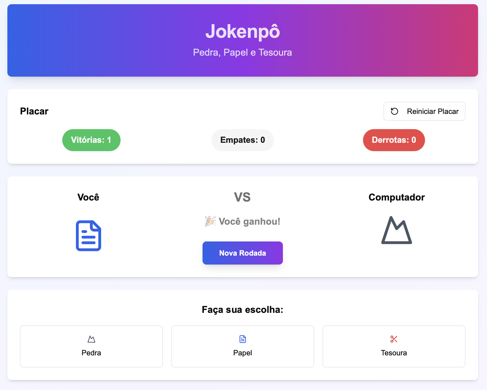

# JokenP- 🎮

Um jogo moderno de Pedra, Papel e Tesoura feito com React, TypeScript e Tailwind CSS.

## ✨ Demonstração

 <!-- Adicione um screenshot real do app aqui, se desejar -->

## 🚀 Funcionalidades

- Jogue Pedra, Papel e Tesoura contra o computador
- Placar com contagem de vitórias, empates e derrotas
- Botão para reiniciar o placar
- Animações e design responsivo
- Interface intuitiva e moderna

## 🛠️ Tecnologias Utilizadas

- React
- TypeScript
- Tailwind CSS
- Lucide Icons

## 📁 Estrutura do Projeto

```
/
├── app/
├── components/
├── hooks/
├── lib/
├── public/
├── styles/
├── jokenpo-game.tsx
├── ...
```

## 🤝 Contribuição

Contribuições são bem-vindas! Sinta-se à vontade para abrir issues ou pull requests.

## 📄 Licença

Este projeto está sob a licença MIT.

---

Acesse o repositório: [https://github.com/OurDeploys/JokenP-](https://github.com/OurDeploys/JokenP-)